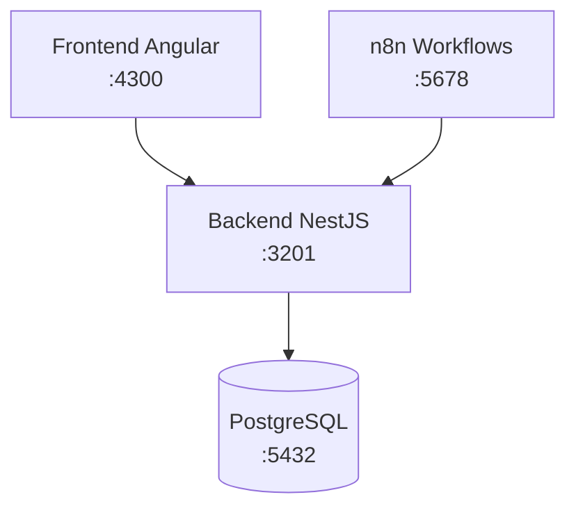
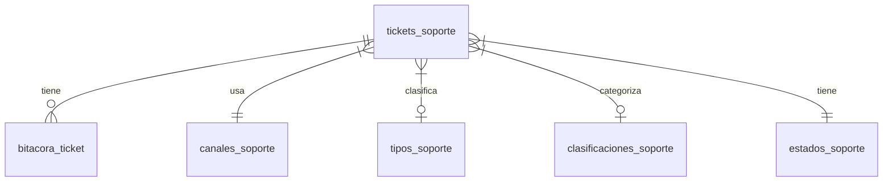
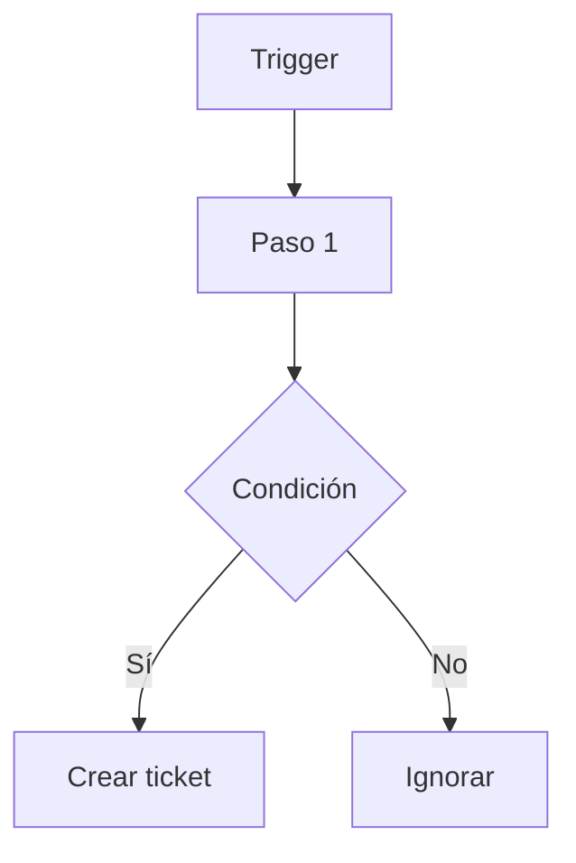

# Skill: Estructura de Documentación — Tiquetera de Soporte

## Contexto del proyecto

Sistema de tiquetera de soporte técnico que recibe casos desde correo y WhatsApp.
n8n actúa como automatizador de flujos de entrada. El backend NestJS centraliza la
lógica de negocio. El frontend Angular provee la interfaz administrativa al equipo
de soporte. PostgreSQL persiste todos los datos.

**Idioma de la documentación:** español en todo lo funcional (endpoints, tablas,
campos, UI). Inglés solo para nombres de archivos, rutas de código y términos
técnicos sin traducción directa (DTO, TypeORM, webhook, workflow, etc.).

**Documentación de referencia existente en el repositorio:**
- `documentacion_tiquetera_angular_nest_es.md` — guía funcional y técnica general
- `documentacion_planificacion_tiquetera.md` — planificación consolidada
- `plan_tecnico_tiquetera.md` — plan técnico de implementación

> Antes de crear cualquier archivo, leer los tres documentos anteriores para
> no duplicar información ya documentada.

---

## Reglas generales antes de escribir

1. **Leer primero el código fuente** del módulo o feature antes de escribir.
2. **No inventar:** documentar solo lo que existe en el código. Si algo está
   pendiente o en construcción, indicarlo con:
   `> **Pendiente:** esta sección se completará cuando el módulo esté implementado.`
3. **Integrar, no reemplazar:** si ya existe documentación del elemento, mejorarla.
4. Usar **tablas** para campos, endpoints y comparaciones.
5. Usar **diagramas Mermaid** cuando el flujo tenga más de 3 pasos o entidades.
6. Bloques de código siempre con el lenguaje declarado (```typescript, ```json, etc.).
7. Seguir **este orden de prioridad** para saber qué documentar primero.

---

## Orden de documentación (prioridad)

| # | Archivo destino | Contenido |
|---|----------------|-----------|
| 1 | `README.md` (raíz) | Descripción general, requisitos, levantamiento rápido |
| 2 | `docs/arquitectura.md` | Diagrama de componentes, tecnologías, puertos |
| 3 | `docs/base-de-datos.md` | Esquema completo, tablas, relaciones, convenciones |
| 4 | `docs/backend/<modulo>.md` | Un archivo por módulo NestJS |
| 5 | `docs/frontend/<feature>.md` | Un archivo por feature Angular |
| 6 | `docs/integraciones/<integracion>.md` | n8n workflows, webhooks, APIs externas |
| 7 | `docs/despliegue.md` | Docker, variables de entorno, pasos de despliegue |

---

## Plantilla 1 — README.md

```markdown
# Tiquetera de Soporte

## Descripción
[Párrafo corto de qué hace el sistema y para quién.]

## Tecnologías
- Backend: NestJS + TypeORM + PostgreSQL
- Frontend: Angular + Angular Material
- Automatización: n8n (Docker)
- Contenedores: Docker Compose

## Requisitos previos
- Docker Desktop instalado
- PostgreSQL accesible en localhost:5432

## Levantar el proyecto
```bash
docker compose up -d
```

| Servicio   | URL                        |
|------------|----------------------------|
| Frontend   | http://localhost:4300       |
| Backend    | http://localhost:3201       |
| Swagger    | http://localhost:3201/api   |
| n8n        | http://localhost:5678       |

## Variables de entorno
Ver `docs/despliegue.md` para el listado completo.
```

---

## Plantilla 2 — docs/arquitectura.md

```markdown
# Arquitectura General

## Descripción
[Párrafo describiendo la arquitectura general.]

## Diagrama de componentes



## Servicios y puertos

| Servicio   | Puerto externo | Puerto interno | Descripción |
|------------|---------------|----------------|-------------|
| frontend   | 4300          | 4200           | SPA Angular |
| backend    | 3201          | 3000           | API REST     |
| n8n        | 5678          | 5678           | Workflows    |

## Flujo general
[Descripción del flujo de datos principal.]
```

---

## Plantilla 3 — docs/base-de-datos.md

```markdown
# Base de Datos

## Esquema: `tiquetera`

## Diagrama entidad-relación



## Tablas

### tickets_soporte
| Columna | Tipo | Descripción |
|---------|------|-------------|
| id | integer PK | Identificador único |
| codigo_ticket | varchar(30) | Código único generado automáticamente |
| ... | ... | ... |

[Repetir para cada tabla relevante]

## Convenciones
- Nombres de tablas en snake_case plural
- PKs siempre `id` integer autoincrement
- Timestamps: `fecha_creacion`, `fecha_actualizacion` gestionados por TypeORM
```

---

## Plantilla 4 — docs/backend/<modulo>.md

```markdown
# Módulo: <Nombre del Módulo>

## Descripción
[Qué responsabilidad tiene este módulo en el sistema.]

## Estructura de archivos
```
src/modulos/<modulo>/
├── entidades/
│   └── <entidad>.entidad.ts
├── dto/
│   ├── crear-<entidad>.dto.ts
│   ├── actualizar-<entidad>.dto.ts
│   └── respuesta-<entidad>.dto.ts
├── <entidad>.servicio.ts
├── <entidad>.controlador.ts
└── <entidad>.modulo.ts
```

## Endpoints

| Método | Ruta | Descripción |
|--------|------|-------------|
| POST   | /api/<ruta> | Crear recurso |
| GET    | /api/<ruta> | Listar recursos |
| GET    | /api/<ruta>/:id | Obtener detalle |
| PATCH  | /api/<ruta>/:id | Actualizar |

### POST /api/<ruta>
**Body:**
```json
{
  "campo": "valor"
}
```
**Respuesta 201:**
```json
{
  "id": 1,
  "campo": "valor"
}
```

## Entidad: <Nombre>
[Descripción de la entidad y sus campos principales.]

## Lógica de negocio relevante
[Reglas especiales, validaciones, generación de códigos, etc.]
```

---

## Plantilla 5 — docs/frontend/<feature>.md

```markdown
# Feature: <Nombre del Feature>

## Descripción
[Qué funcionalidad ofrece este feature al usuario.]

## Ruta Angular
`/<ruta>` — accesible desde el menú lateral.

## Componentes

| Componente | Archivo | Responsabilidad |
|------------|---------|----------------|
| <nombre>Component | `<ruta>.component.ts` | [descripción] |

## Servicios utilizados
- `<Nombre>Service` — [para qué lo usa]

## Flujo de usuario
1. El usuario accede a la ruta `/<ruta>`
2. [Paso 2...]

## Capturas de pantalla
> Agregar imágenes si están disponibles en el repositorio.
```

---

## Plantilla 6 — docs/integraciones/<integracion>.md

```markdown
# Integración: <Nombre>

## Descripción
[Qué automatiza esta integración y por qué existe.]

## Tecnología
n8n — workflow local en Docker.

## Diagrama de flujo



## Configuración necesaria

| Variable / Credencial | Valor / Descripción |
|----------------------|---------------------|
| GMAIL_USER | Correo desde el que se leen mensajes |
| BACKEND_URL | http://host.docker.internal:3201 |

## Endpoint consumido
`POST /api/integraciones/evaluar-mensaje`

**Body enviado:**
```json
{
  "remitente": "cliente@empresa.com",
  "asunto": "Error en el sistema",
  "cuerpo": "Texto del mensaje",
  "canal": "WHATSAPP",
  "referenciaExterna": "msg-id-123"
}
```

## Importar el workflow en n8n
1. Abrir n8n en http://localhost:5678
2. Ir a Workflows → Import from file
3. Seleccionar `n8n/workflows/<nombre>.json`
```

---

## Plantilla 7 — docs/despliegue.md

```markdown
# Guía de Despliegue

## Requisitos
- Docker Desktop >= 4.x
- PostgreSQL >= 14 corriendo localmente
- Base de datos `tiquetera` creada (ver `init_tiquetera.sql`)

## Variables de entorno (docker-compose.yml)

| Variable | Servicio | Valor por defecto | Descripción |
|----------|---------|-------------------|-------------|
| DB_HOST | backend | host.docker.internal | Host de PostgreSQL |
| DB_PORT | backend | 5432 | Puerto PostgreSQL |
| DB_USER | backend | postgres | Usuario BD |
| DB_PASS | backend | admin | Contraseña BD |
| DB_NAME | backend | tiquetera | Nombre BD |
| N8N_BASIC_AUTH_USER | n8n | admin | Usuario n8n |
| N8N_BASIC_AUTH_PASSWORD | n8n | admin | Contraseña n8n |

## Pasos de despliegue

```bash
# 1. Clonar el repositorio
# 2. Crear la base de datos
psql -U postgres -f init_tiquetera.sql

# 3. Levantar todos los servicios
docker compose up -d

# 4. Verificar que los servicios estén corriendo
docker compose ps
```

## Inicializar datos maestros
Ejecutar `create_database_tiquetera.sql` para poblar los catálogos iniciales.

## Acceder a n8n
1. Abrir http://localhost:5678
2. Credenciales: admin / admin (cambiar en producción)
3. Importar workflows desde `n8n/workflows/`
```

---

## Tabla de módulos y features del proyecto

| Tipo | Nombre | Archivo docs | Estado |
|------|--------|-------------|--------|
| Módulo backend | catalogos | `docs/backend/catalogos.md` | Por documentar |
| Módulo backend | tickets-soporte | `docs/backend/tickets-soporte.md` | Por documentar |
| Módulo backend | bitacora-ticket | `docs/backend/bitacora-ticket.md` | Por documentar |
| Módulo backend | integraciones | `docs/backend/integraciones.md` | Por documentar |
| Feature frontend | bandeja-tickets | `docs/frontend/bandeja-tickets.md` | Por documentar |
| Feature frontend | detalle-ticket | `docs/frontend/detalle-ticket.md` | Por documentar |
| Feature frontend | catalogos | `docs/frontend/catalogos.md` | Por documentar |
| Integración | whatsapp-n8n | `docs/integraciones/whatsapp-n8n.md` | Por documentar |

---

## Checklist de cierre de sesión de documentación

Al terminar una sesión de documentación, verificar:
- [ ] ¿El archivo nuevo tiene frontmatter o sección de descripción?
- [ ] ¿Los endpoints tienen ejemplos de body y respuesta?
- [ ] ¿Las tablas de BD tienen descripción de columnas?
- [ ] ¿Los flujos complejos tienen diagrama Mermaid?
- [ ] ¿Se actualizó la tabla de estado en este skill?
